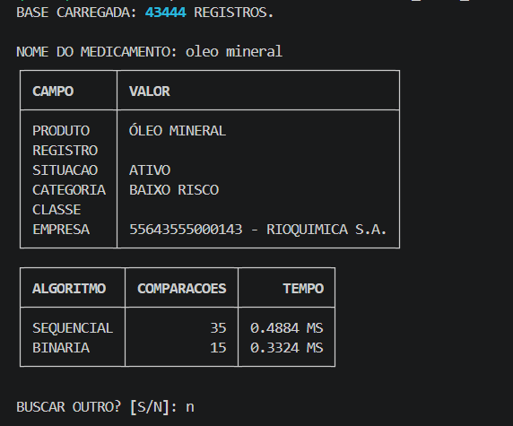

<h1 align="center">Busca_Medicamentos</h1>

<p align="center">
  Ferramenta de linha de comando para consultar medicamentos da Anvisa<br>
  e comparar, na prática, o desempenho da busca sequencial e da busca binária.
</p>

<p align="center">
  
  
  
  
</p>

---

## Sobre o projeto

**Busca_Medicamentos** é um trabalho da disciplina **Estruturas de Dados 2 (2026.2)** da Universidade de Brasília - FCTE.

A aplicação utiliza uma base real de medicamentos disponibilizada pela Anvisa para comparar duas estratégias de busca:

- **Busca sequencial - `O(n)`**
- **Busca binária - `O(log n)`**

As duas estratégias recebem a **mesma consulta pelo nome do medicamento**, permitindo comparar de forma coerente:

- número de comparações realizadas;
- tempo de execução da busca;
- comportamento dos algoritmos sobre uma base real.

A aplicação é executada pelo terminal e apresenta o medicamento encontrado e as métricas dos dois algoritmos lado a lado.

---

## Integrantes

<div align="center">

| [](https://github.com/arthurrochamoreira)<br><nobr><sub style="font-size: 160%;">Arthur Moreira</sub></nobr> | [](https://github.com/dev-LucasDpaula)<br><nobr><sub style="font-size: 160%;">Lucas D. Paula</sub></nobr> |
| :---: | :---: |
| 21/1030658 | 24/1011386 |

</div>

---

- Link para apresentação: 

---

## Base de dados

O projeto utiliza o arquivo:

```text
data/DADOS_ABERTOS_MEDICAMENTOS.csv
```

publicado no portal de dados abertos da Anvisa.

| Característica | Valor |
| :--- | :--- |
| **Registros** | 43.444 |
| **Snapshot** | 30/08/2026 |
| **Formato** | CSV |
| **Separador** | `;` |
| **Codificação utilizada pelo loader** | `cp1252` |
| **Quantidade de campos** | 11 |

### Campos disponíveis

```text
TIPO_PRODUTO
NOME_PRODUTO
DATA_FINALIZACAO_PROCESSO
CATEGORIA_REGULATORIA
NUMERO_REGISTRO_PRODUTO
DATA_VENCIMENTO_REGISTRO
NUMERO_PROCESSO
CLASSE_TERAPEUTICA
EMPRESA_DETENTORA_REGISTRO
SITUACAO_REGISTRO
PRINCIPIO_ATIVO
```

> A Anvisa pode substituir o arquivo publicado sem manter versionamento do conteúdo. Por isso, os números e resultados documentados neste repositório referem-se ao snapshot utilizado pelo grupo.

---

## Como os dados são carregados

O carregamento da base é feito com **pandas**.

Cada linha do CSV é transformada em um objeto `Medicamento`, permitindo que os algoritmos trabalhem sobre:

```text
list[Medicamento]
```

Fluxo simplificado:

```text
CSV da Anvisa
      ↓
pandas.read_csv()
      ↓
DataFrame
      ↓
Medicamento
      ↓
list[Medicamento]
      ↓
algoritmos de busca
```

---

## Algoritmos implementados

| Algoritmo | Complexidade | Chave de busca | Pré-processamento |
| :--- | :---: | :--- | :--- |
| **Busca sequencial** | `O(n)` | `NOME_PRODUTO` | Não |
| **Busca binária** | `O(log n)` | `NOME_PRODUTO` | Ordenação prévia por nome normalizado |

### Busca sequencial

A busca sequencial percorre a lista original desde o primeiro registro.

A cada medicamento examinado:

```text
comparações += 1
```

A execução termina quando uma correspondência exata do nome normalizado é encontrada ou quando todos os registros forem examinados.

No pior caso, a busca pode percorrer os **43.444 registros** da base.

### Busca binária

Para a busca binária, uma segunda lista é criada e ordenada pelo nome normalizado do medicamento.

A cada iteração, o algoritmo examina o elemento central e elimina aproximadamente metade do espaço de busca:

```text
                    MEIO
                      ↓
[---------------------------------------------]
alvo < meio                     alvo > meio
    ↓                               ↓
metade esquerda                metade direita
```

Com uma base de 43.444 registros, a quantidade de elementos examinados fica normalmente próxima de **15 ou 16 comparações**.

### Nomes repetidos

A base possui diversos medicamentos com o mesmo `NOME_PRODUTO`.

Quando a busca binária encontra um nome, ela continua procurando à esquerda da lista ordenada para localizar a **primeira ocorrência** daquele nome.

Isso mantém o comportamento compatível com a busca sequencial, que também encerra na primeira ocorrência correspondente.

---

## Normalização dos nomes

A base da Anvisa contém diferenças de capitalização, acentuação e algumas entidades HTML.

Por exemplo, um valor pode estar armazenado como:

```text
&#211;LEO MINERAL
```

mas o usuário pode pesquisar:

```text
oleo mineral
```

Antes das comparações, o texto passa por uma etapa de normalização que:

- interpreta entidades HTML;
- remove espaços excedentes;
- ignora diferenças entre maiúsculas e minúsculas;
- remove acentuação para fins de comparação;
- normaliza variações de apóstrofos.

Assim, consultas como:

```text
IBUPROFENO
ibuprofeno
Ibuprofeno
```

são tratadas como a mesma chave de busca.

Da mesma forma:

```text
oleo mineral
```

pode localizar corretamente:

```text
ÓLEO MINERAL
```

> A normalização é utilizada para comparação e ordenação. Os dados originais do CSV não são alterados.

---

## Comparação justa entre os algoritmos

Os dois algoritmos recebem exatamente a **mesma consulta pelo nome do medicamento**.

```text
                     nome pesquisado
                           ↓
                 ┌─────────┴─────────┐
                 ↓                   ↓
           SEQUENCIAL             BINÁRIA
                 ↓                   ↓
        lista original        lista ordenada
                 ↓                   ↓
           comparações          comparações
                 ↓                   ↓
               tempo               tempo
```

A ordenação necessária para a busca binária é realizada **uma única vez**, antes do início do loop de consultas.

O tempo gasto nessa preparação não faz parte do tempo medido para uma consulta binária. A aplicação compara especificamente o custo das operações de busca após as estruturas estarem preparadas.

---

## Exemplo de execução

Execute:

```bash
make run
```

Exemplo utilizando `IBUPROFENO`:

```console
BASE CARREGADA: 43444 REGISTROS.

NOME DO MEDICAMENTO: ibuprofeno

┌───────────┬─────────────────────────────────────────────────────────────┐
│ CAMPO     │ VALOR                                                       │
├───────────┼─────────────────────────────────────────────────────────────┤
│ PRODUTO   │ IBUPROFENO                                                  │
│ REGISTRO  │ 167730688                                                   │
│ SITUACAO  │ ATIVO                                                       │
│ CATEGORIA │ GENÉRICO                                                    │
│ CLASSE    │ ANALGESICOS NAO NARCOTICOS                                  │
│ EMPRESA   │ 05044984000126 - LEGRAND PHARMA INDÚSTRIA FARMACÊUTICA LTDA │
└───────────┴─────────────────────────────────────────────────────────────┘

┌────────────┬─────────────┬────────────┐
│ ALGORITMO  │ COMPARACOES │      TEMPO │
├────────────┼─────────────┼────────────┤
│ SEQUENCIAL │         504 │     ... MS │
│ BINARIA    │          15 │     ... MS │
└────────────┴─────────────┴────────────┘
```

> O tempo de execução varia conforme hardware, sistema operacional e carga da máquina. O número de comparações é uma métrica mais estável para observar o comportamento dos algoritmos.

---

## Resultados observados

Durante os testes com o snapshot utilizado pelo grupo, foram observados exemplos como:

| Consulta | Sequencial | Binária |
| :--- | ---: | ---: |
| `IBUPROFENO` | 504 comparações | 15 comparações |
| `OLEO MINERAL` | 35 comparações | 15 comparações |
| `NEOSORO` | 6.926 comparações | 16 comparações |

Os resultados evidenciam a diferença esperada entre os comportamentos assintóticos:

```text
Busca sequencial → O(n)
Busca binária    → O(log n)
```

Na busca sequencial, a posição do registro na lista original influencia diretamente o número de comparações.

Na busca binária, a quantidade de comparações permanece pequena mesmo com dezenas de milhares de elementos, desde que a coleção esteja previamente ordenada.

---

## Estrutura do projeto

```text
G14_Busca_EDA2-2026.2/
│
├── data/
│   └── DADOS_ABERTOS_MEDICAMENTOS.csv
│
├── src/
│   ├── __init__.py
│   ├── busca.py
│   ├── main.py
│   ├── tabela.py
│   │
│   ├── data/
│   │   ├── __init__.py
│   │   └── loader.py
│   │
│   └── models/
│       ├── __init__.py
│       └── medicamento.py
│
├── tests/
│   ├── test_busca.py
│   └── test_busca_binaria.py
│
├── scripts/
├── Makefile
├── requirements.txt
├── README.md
└── .gitignore
```

### Responsabilidades principais

| Arquivo | Responsabilidade |
| :--- | :--- |
| `src/models/medicamento.py` | Estrutura que representa um medicamento |
| `src/data/loader.py` | Leitura e transformação do CSV |
| `src/busca.py` | Normalização, busca sequencial e busca binária |
| `src/tabela.py` | Apresentação dos resultados com Rich |
| `src/main.py` | Fluxo principal e interação com o usuário |
| `tests/test_busca.py` | Testes da busca sequencial |
| `tests/test_busca_binaria.py` | Testes da preparação e busca binária |

---

## Tecnologias utilizadas

- **Python 3**
- **pandas** - leitura da base CSV
- **Rich** - interface e tabelas no terminal
- **pytest** - testes automatizados
- **Ruff** - análise de estilo e qualidade do código
- **GNU Make** - automação do ambiente e comandos do projeto

---

## Guia de instalação

### 1. Clone o repositório

```bash
git clone https://github.com/eda2-2026/G14_Busca_EDA2-2026.2.git
cd G14_Busca_EDA2-2026.2
```

### 2. Pré-requisitos

#### Linux - Ubuntu/Debian

```bash
sudo apt update
sudo apt install -y make python3 python3-pip python3-venv
```

#### Windows

Instale:

- Git for Windows;
- Python;
- Chocolatey;
- GNU Make.

Com Chocolatey, o Make pode ser instalado com:

```powershell
choco install make -y
```

No Windows, recomenda-se executar os comandos `make` pelo **PowerShell** ou **Prompt de Comando**.

### 3. Configure o ambiente

```bash
make setup
```

O comando:

- verifica o interpretador Python;
- cria o ambiente virtual `.venv`;
- instala/sincroniza as dependências do `requirements.txt`;
- valida o ambiente.

### 4. Execute a aplicação

```bash
make run
```

---

## Comandos disponíveis

| Comando | Função |
| :--- | :--- |
| `make setup` | Cria e configura o ambiente |
| `make run` | Executa a aplicação |
| `make test` | Executa os testes automatizados |
| `make lint` | Analisa o código com Ruff |
| `make clean` | Remove o ambiente virtual e arquivos temporários |
| `make help` | Exibe os comandos disponíveis |

---

## Testes

Para executar a suíte:

```bash
make test
```

Atualmente o projeto possui testes para:

- busca sequencial;
- busca binária;
- lista vazia;
- elemento existente;
- elemento inexistente;
- primeiro e último elementos;
- ordenação da estrutura binária;
- normalização de caixa;
- acentuação e entidades HTML.

Na versão atual, a suíte possui **11 testes automatizados**.

Para verificar o estilo:

```bash
make lint
```

---

## Características e limitações

- A consulta é feita pelo **nome exato após normalização**.
- A aplicação não realiza busca genérica por substring.
- Quando existem múltiplos registros com o mesmo nome, é retornada a primeira ocorrência.
- A busca binária exige uma coleção previamente ordenada.
- O tempo de ordenação não é incluído no tempo de uma consulta binária.
- Tempos de execução podem variar entre máquinas.
- Os resultados documentados correspondem ao snapshot da Anvisa utilizado pelo grupo.

---

## Capturas de tela



---

## Conclusões

Os experimentos realizados com a base de **43.444 medicamentos** demonstram, na prática, a diferença entre uma estratégia de busca linear e uma estratégia baseada em divisão sucessiva do espaço de busca.

A busca sequencial possui a vantagem de operar diretamente sobre a coleção original, sem exigir ordenação prévia. Entretanto, seu custo cresce linearmente com a quantidade de elementos examinados.

A busca binária exige que os dados estejam previamente ordenados, mas reduz significativamente o número de registros examinados durante cada consulta. Nos testes realizados, buscas que exigiram centenas ou milhares de comparações na estratégia sequencial foram resolvidas em aproximadamente 15 ou 16 comparações pela estratégia binária.

O projeto permite, portanto, observar sobre uma base real os comportamentos esperados de:

```text
O(n)      → busca sequencial
O(log n)  → busca binária
```

além de mostrar a importância da preparação dos dados e da escolha adequada da estrutura utilizada para realizar consultas.

---

## Referências

- **ANVISA.** Dados abertos - Medicamentos. https://dados.anvisa.gov.br/dados/
- **ROSA, J. L. G.** *SCC-201 - Métodos de Busca.* ICMC/USP, 2009.
- **CORMEN, T. H. et al.** *Introduction to Algorithms.* 3rd ed. MIT Press, 2009.

---

<p align="center">
  <sub>Trabalho 1 da disciplina Estruturas de Dados 2 - 2026.2</sub><br>
  <sub>Universidade de Brasília - FCTE - Prof. Maurício Serrano</sub>
</p>
